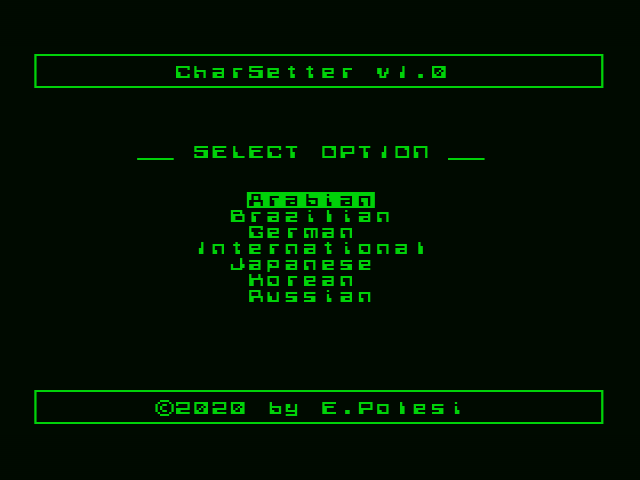
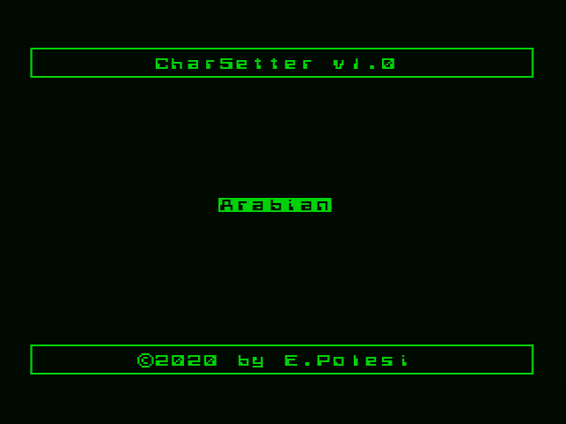
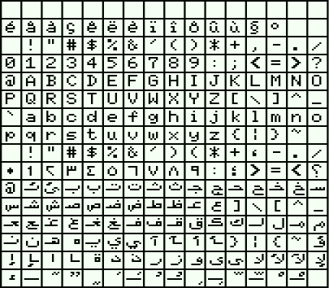
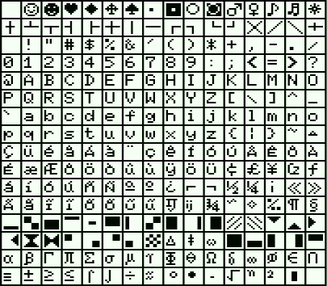
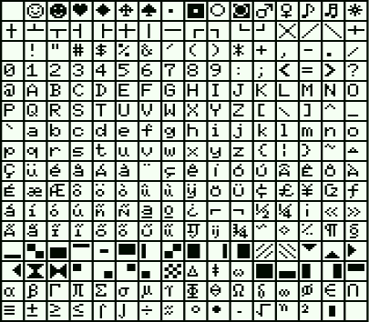
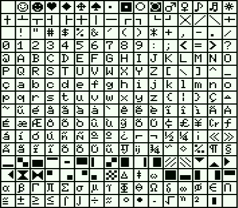
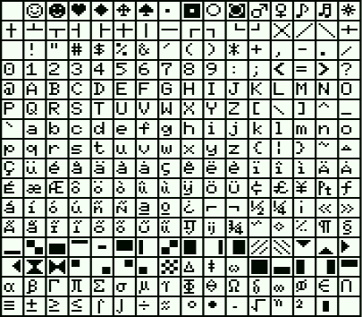
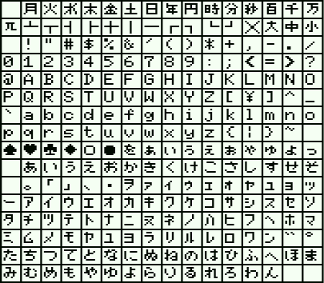
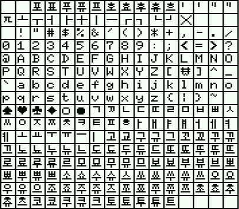
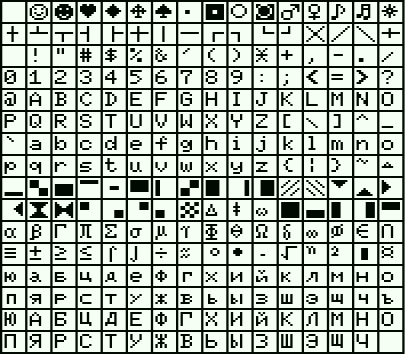

# CharSetter

A charset (character set) changer utility for the [MSX](https://en.wikipedia.org/wiki/MSX) System. 

***

This program changes the original character set of a MSX manchine. It is meant to run in ROM, through a cartridge. It was developed using the C language and Z-80 Assembly. 

It can be useful for those who wants to run MSX software designed for different languages from the hardware localization, so that all characters and symbols can be displayed correctly in the original software language, without hardware modifications.
  
This program acts on the charset font bitmap, it doesn't affect key mappings or keyboard configuration.
  
The compilation generates a collection of .rom files in the **bin** directory. One of them, the **CharSetter_multi_menu.rom**, offers support for multiple charsets, with menu selection, and has 32KB of size. The rest of the .rom files, named **CharSetter_single_\*.rom**, are single-charset, without menu, and have 16KB of size.

The single-charset ROMs can be useful for people who often runs software made for a specific charset (language), and don't want to stop at every boot to select that specific charset.

The multi-charset ROM can be useful for people who often runs software made for many different charsets (languages), and/or don't bother selecting the charset at every boot.

CharSetter can be deactivated at boot time by holding down the UP key for a while, during the machine boot. For the multi-charset version, you can also abort CharSetter by pressing ESC at the main menu.

The following MSX charsets are supported:

>* Arabian
>* Brazilian BRASCII (Gradiente)
>* Brazilian BRASCII (Sharp)
>* Brazilian Gradiente v1.0
>* Brazilian Sharp v1.1
>* German
>* International
>* Japanese
>* Korean
>* Russian

In the **src** directory there is a little bonus utility, written in MSX-BASIC, named **SHOWCSET.ASC**, which can be used to check the current character set active on the machine.

There are future plans for some improvements, like: BASIC extensions and MSX-DOS utilities to allow easy reconfiguration of the charset after the boot.

Another idea for the future, is to take advantage of the core of this project and create a MultiFont cartridge, with different stylish fonts, just for fun.

For more information about MSX character sets and fonts, take a look at [https://www.msx.org/wiki/MSX_font](https://www.msx.org/wiki/MSX_font) and at [https://www.msx.org/wiki/MSX_Characters_and_Control_Codes](https://www.msx.org/wiki/MSX_Characters_and_Control_Codes).

***

Compilation
-----------

The prerequisites to compile the program are:
1) Windows machine or VM;
2) [SDCC (Small Device C Compiler)](<http://sdcc.sourceforge.net/>) installed and available in the [PATH](<https://en.wikipedia.org/wiki/PATH_(variable)>). The version I've used is 4.0.0, but newer (and some older) versions could also work.
3) [Hex2Bin.exe](<http://hex2bin.sourceforge.net/>) available in the [PATH](<https://en.wikipedia.org/wiki/PATH_(variable)>).

Once you have fulfilled the prerequisites, just enter into the **src** directory and run the **compile.bat** script.

***

Screenshots
-----------

- **Multi-charset main menu:**

- **CharSetter selected option example:**

***

Charsets
-----------

- **Arabian:**

- **Brazilian BRASCII (Gradiente 1.1):**

- **Brazilian BRASCII (Sharp 1.2):**

- **Brazilian Gradiente v1.0:**

- **Brazilian Sharp v1.1:**

- **German:**

- **International:**

- **Japanese:**

- **Korean:**

- **Russian:**

***
